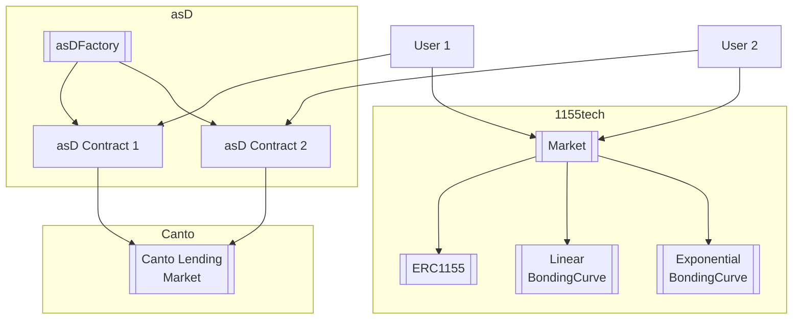

[Canto](https://canto.io/) is a permissionless general-purpose blockchain running the Ethereum Virtual Machine (EVM). It was built to deliver on the promise of DeFi – that through a post-traditional financial movement, new systems will be made accessible, transparent, decentralized, and free.
At launch, Canto provides an EVM execution layer via [Ethermint](https://docs.ethermint.zone/), secured by a Proof of Stake Cosmos SDK consensus layer, in addition to core [Free Public Infrastructure (FPI)](https://canto.gitbook.io/canto/welcome/how-does-canto-work/free-public-infrastructure-fpi) primitives. These primitives include:
[Canto DEX](https://github.com/free-public-infrastructure-fpi/dex) — a zero-fee DEX for liquidity providers
[Canto Lending Market (CLM)](https://github.com/free-public-infrastructure-fpi/lending-market) — a pooled lending Compound v2 fork
[$NOTE](https://github.com/free-public-infrastructure-fpi/note) — a fully collateralized unit of account token issued by the CLM which also serves the ecosystem as a USDC/USDT soft-pegged stablecoin

The overall architecture using asD tokens as the backing for 1155tech shares is solid. Pegging shares to a stablecoin with yield allows monetization for creators while still maintaining price stability.

### Some key strengths:

- asD provides flexible, trustless stablecoin issuance while accruing yield to creators. This provides a superior backing asset for 1155tech.

- The modular approach makes it easy to add other bonding curves or customizable shares in the future. 

- Share creation, buying, selling, fees, and NFT minting/burning are logically implemented in the 1155tech contract.

- Restricting creators from buying their own shares helps align incentives.

- Allowing both permissionless and whitelisted creation modes provides flexibility.

## Architecture

**Application Specific Dollars (asD)**

The asD contracts allow creating customizable stablecoins pegged 1:1 to NOTE and accruing interest to creators.

**Key Components:**

- asDFactory - Factory contract for deploying new asD contracts

- asD - Individual ERC20 stablecoin contract per asset

- Canto Lending Market - Used for staking NOTE to back asD and generate yield

## 1155tech 

The 1155tech contracts enable issuing ERC1155 NFT shares with customizable bonding curves. 

**Key Components:**

- Market - Main contract for creating shares, buying, selling, fees

- BondingCurves - Various contracts defining price curves like LinearBondingCurve

- ERC1155 - NFT contract inherited by Market

## Flow

1. asDFactory deploys asD stablecoin contracts

2. Each asD mints coins backed 1:1 by NOTE staked in Canto 

3. 1155tech Market creates shares connected to bonding curves  

4. Users can buy/sell share tokens accruing fees

5. Users can wrap share tokens into ERC1155 NFTs

6. asD creators and 1155tech shareholders earn yield

[Market.sol](https://github.com/code-423n4/2023-11-canto/blob/main/1155tech-contracts/src/Market.sol)


[LinearBondingCurve.sol](https://github.com/code-423n4/2023-11-canto/blob/main/1155tech-contracts/src/bonding_curve/LinearBondingCurve.sol)


[asDFactory.sol](https://github.com/code-423n4/2023-11-canto/blob/main/asD/src/asDFactory.sol)


[asD.sol](https://github.com/code-423n4/2023-11-canto/blob/main/asD/src/asD.sol)


## Interactions

- asD integrates with Canto lending market to generate yield

- 1155tech uses asD (or other tokens) as its currency

- Bonding curves define pricing models for shares

- ERC1155 provides NFT wrapping of shares



**Description:**

- `asDFactory` deploys `asD` contracts
- Each `asD` integrates with Canto Lending Market 
- `Market` creates shares connected to `BondingCurve` contracts 
- `Market` inherits from `ERC1155` for NFT wrapping
- Users can interact with both `asD` and `Market` contracts

## asD

The core invariant is the 1:1 peg between asD and NOTE. These are some ways this could theoretically be violated:

- `withdrawCarry()` does not properly check cToken exchange rate before withdrawing, allowing more NOTE to be withdrawn than earned interest

- `withdrawCarry()` has a bug when calculating maximum withdrawable amount based on exchange rate and supply

- Compound cToken interest accumulation or exchange rate has a bug that incorrectly inflates withdrawable amount

- `redeemUnderlying()` call fails or does not redeem the expected NOTE amount 

- Note transfer after `redeemUnderlying()` fails, so NOTE is not removed from the contract

- `mint()` does not properly deposit user's NOTE into Compound, creating a shortfall

- User flash loans asD, withdraws NOTE, then defaults - net loss of NOTE in contract

To elaborate, the core invariant is:

As mentioned in the [Main Invariant](https://code4rena.com/contests/2023-11-canto-application-specific-dollars-and-bonding-curves-for-1155s#top), It should always be possible to redeem 1 asD for 1 NOTE 

This could be violated in a few ways:

**Faulty withdrawCarry()**

The key risk is in [withdrawCarry()](https://github.com/code-423n4/2023-11-canto/blob/b78bfdbf329ba9055ba24bd710c7e1c60251039a/asD/src/asD.sol#L72-L91):

```solidity
// asD.sol

function withdrawCarry(uint256 _amount) external onlyOwner {

  // Calculation of maximum withdrawable amount based on:
  // - cToken exchange rate
  // - Total asD supply
  // - cToken balance
  
  if(_amount > maximumWithdrawable) {
    revert(); 
  }

  // Withdraw _amount of NOTE
  // Transfer NOTE to owner
}
```

If the maximum withdrawable amount is calculated incorrectly, the owner could withdraw more NOTE than what has been earned, breaking 1:1 backing.

This could happen if:

- The cToken exchange rate is manipulated or fetched incorrectly
- Total asD supply is not accurate
- Calculation fails to account for some earned interest

Proper unit tests are critical to validate interest calculations and maximum withdrawable amount.

**Issues in other functions**

- [mint()](https://github.com/code-423n4/2023-11-canto/blob/b78bfdbf329ba9055ba24bd710c7e1c60251039a/asD/src/asD.sol#L47-L56) and [burn()](https://github.com/code-423n4/2023-11-canto/blob/b78bfdbf329ba9055ba24bd710c7e1c60251039a/asD/src/asD.sol#L60-L67) rely on Compound's `mint()` and redeemUnderlying() to transfer NOTE. Bugs or failures in these could disrupt the 1:1 rate.

- If `redeemUnderlying()` does not redeem the expected NOTE amount, `burn()` would break 1:1 rate.

- Failed NOTE transfer after `redeemUnderlying()` could lead to loss of redeemed NOTE.

- Flash loan attacks could mint asD, steal NOTE, then default - resulting in net NOTE loss.

Careful handling of Compound integration and transfers is important. Thorough test coverage can validate. Formal verification of the invariant would provide further assurance.

##1155tech 

The core invariant is outstanding tokens must be sellable for the contract's holdings. Issues:

- Bonding curve formula is incorrect, allowing tokens to be sold for incorrect price

- Buy and sell functions do not properly apply bonding curve pricing

- Fees exceed sale proceeds, blocking unwinding of some positions

- Rounding errors when computing fees cause loss of precision

- Tokens can be minted without payment, inflating outstanding supply

- Tokens can be burned without updating outstanding token counts

- Transferring token owner allows position unwind without updating contract state

- Flash loan attack to buy share, mint NFT, sell share back, keep NFT

The core 1155tech invariant. Here is an in-depth analysis of potential issues:

The invariant is:

It should always be possible to sell all outstanding tokens for the tokens in the contract.

This could be violated if:

**Faulty bonding curve formula**

If the bonding curve formula is incorrect, tokens could be mispriced when bought/sold: For example.

```solidity
// LinearBondingCurve.sol

function getPrice(uint256 supply) external view returns (uint256) {

  // Incorrect formula:
  return supply * priceIncrement;

  // Should be:
  return supply ^ 2 * priceIncrement; 
}
```

Prices would not match expected curves, allowing possible manipulation.

**Incorrectly applying formula**

Even with correct curve formula, prices must be properly calculated in Market's buy/sell.

If fees are added incorrectly or curve prices not applied, unwinding could fail.

**Excessive fees** 

If fees exceed sale proceeds, it could block unwinding of some positions:

```solidity
uint256 fee = getFee(supply + amount);
uint256 price = getPrice(supply);

// Fee > price, sale reverts
require(price > fee) 
```

Caps may be needed for extreme cases.

**Loss of precision** 

Rounding errors when computing fees over many iterations could compound and result in loss of holder funds.

**Unverified minting/burning**

If NFTs are minted without payment or burned without updating supply, it could inflate outstanding tokens.

Tight access controls and validation are essential.

**Flash loan attack**

Attackers could exploit flash loans and front-running to buy share tokens, mint NFTs, sell back tokens, while keeping NFTs and draining collateral. 

# Potential Issues

## Centralization Risks

The owner/admin roles in both asD and 1155tech present centralization risks. The impact is partially mitigated by only allowing predictable privileged actions like pausing, role management, and collecting fees. Still, both contracts would benefit from a DAO-controlled admin role with timelocks rather than a single owner address.

Thank you for asking me to expand on the centralization risks. Here is more detail:

The core issue is that critical admin powers in both asD and 1155tech are concentrated in single owner accounts. 

For example, in [asD:#withdrawCarry](https://github.com/code-423n4/2023-11-canto/blob/b78bfdbf329ba9055ba24bd710c7e1c60251039a/asD/src/asD.sol#L72-L91)

```solidity
// Owner can withdraw all interest
function withdrawCarry() external onlyOwner {
  // ...
}

// Owner can upgrade contract
function upgrade(address newImplementation) external onlyOwner {
  // ...
}
```

And similarly in 1155tech: [#changeBondingCurveAllowed](https://github.com/code-423n4/2023-11-canto/blob/335930cd53cf9a137504a57f1215be52c6d67cb3/1155tech-contracts/src/Market.sol#L104-L108), [claimPlatformFee](https://github.com/code-423n4/2023-11-canto/blob/335930cd53cf9a137504a57f1215be52c6d67cb3/1155tech-contracts/src/Market.sol#L244-L249)

```solidity 
// Owner can change bonding curve whitelist
function changeBondingCurveAllowed(address _bondingCurve, bool _newState) external onlyOwner {
  // ...
}

// Owner can claim platform fees
function claimPlatformFee() external onlyOwner {
  // ... 
}
```

This means the owner accounts have centralized control over interest withdrawals, contract upgrades, pausing, whitelisting, fee distributions, and other sensitive functionality.

The maximum risk is that the owner could abuse this power or have their key compromised. For example:

- The asD owner could withdraw more interest than accrued, breaking the 1:1 peg. 

- The 1155tech owner could steal platform fees or whitelist a malicious bonding curve.

- A compromised owner key could wreak havoc.

These centralized privileges provide a single point of failure.

To mitigate this, an admin DAO with timelocked multisig control could be used instead of a single owner address. This would distribute control across a group and add a time delay to critical operations.

## Missing Input Validation 

Several functions like `asDFactory.create()` and `Market.createNewShare()` do not validate inputs thoroughly. This could allow creators to choose confusing or inappropriate names/symbols for shares or coins.

[asDFactory.create()](https://github.com/code-423n4/2023-11-canto/blob/b78bfdbf329ba9055ba24bd710c7e1c60251039a/asD/src/asDFactory.sol#L33-L39)

```solidity
    function create(string memory _name, string memory _symbol) external returns (address) {
        asD createdToken = new asD(_name, _symbol, msg.sender, cNote, owner());
        isAsD[address(createdToken)] = true;
        emit CreatedToken(address(createdToken), _symbol, _name, msg.sender);
        return address(createdToken);
    }
}
```

[Market.createNewShare()](https://github.com/code-423n4/2023-11-canto/blob/335930cd53cf9a137504a57f1215be52c6d67cb3/1155tech-contracts/src/Market.sol#L114-L127)

```solidity
    function createNewShare(
        string memory _shareName,
        address _bondingCurve,
        string memory _metadataURI
    ) external onlyShareCreator returns (uint256 id) {
        require(whitelistedBondingCurves[_bondingCurve], "Bonding curve not whitelisted");
        require(shareIDs[_shareName] == 0, "Share already exists");
        id = ++shareCount;
        shareIDs[_shareName] = id;
        shareData[id].bondingCurve = _bondingCurve;
        shareData[id].creator = msg.sender;
        shareData[id].metadataURI = _metadataURI;
        emit ShareCreated(id, _shareName, _bondingCurve, msg.sender);
    }
```

Standard input sanitization like length limits, alphanumeric checks, and disallowed terms lists would improve the robustness.

## Specification Inconsistencies

Some areas like the fee calculations have inconsistencies between the comments/documentation and the implemented code. While not security issues, keeping specs and code properly in sync improves auditability and developer experience.

## Fee Calculation Overflows

The accumulating fee values in functions like `LinearBondingCurve.getPriceAndFee()` are vulnerable to overflows from unbounded multiplication. This could potentially corrupt state if fees grow too large. Using SafeMath style arithmetic would address this.

The vulnerable code is in [LinearBondingCurve.getPriceAndFee()](https://github.com/code-423n4/2023-11-canto/blob/b78bfdbf329ba9055ba24bd710c7e1c60251039a/1155tech-contracts/src/bonding_curve/LinearBondingCurve.sol#L14-L25):

```solidity
// LinearBondingCurve.sol

function getPriceAndFee(uint256 shareCount, uint256 amount) 
  external view returns (uint256 price, uint256 fee) {

  for (uint256 i = shareCount; i < shareCount + amount; i++) {

    uint256 tokenPrice = priceIncrease * i;
    
    price += tokenPrice; // No overflow check

    fee += (getFee(i) * tokenPrice) / 1e18; // No overflow check
  }
}
```

The issue is with the unchecked `price += tokenPrice` and `fee += feeAmount` statements inside the for loop. 

Both `price` and `fee` are uint256 values being incremented each loop iteration. If `amount` * `priceIncrease` overflows, the final fee and price could end up much lower than intended.

For example, if `priceIncrease` was very large like 2^256 - 1, `tokenPrice` would overflow to 0. Then `price` would only increase from 0 each time instead of the proper amount.

An attacker could pass a large `amount` like 1000 with a maximized `priceIncrease` to purchase many tokens for a heavily discounted price due to the overflow.

This corrupts the core pricing model. The root cause is accumulating values without checking for overflow first.

To mitigate, we need to add overflow validation using SafeMath-style code:

```solidity
// Inside for loop

price = price + tokenPrice; 
require(price >= tokenPrice, "Overflow");

fee = fee + feeAmount;
require(fee >= feeAmount, "Overflow"); 
```

This validates the price and fee stay within uint256 range after each addition.


## Outstanding Vulnerabilities

No major security issues were identified, but as a new protocol, 1155tech would benefit from a professional audit focusing on potential attack vectors. Areas to scrutinize closely include bonding curve manipulations, flash loan attacks, sandwich attacks around fee accrual, and reentrancy across the stateful operations.

# Testing & Verification

Unit tests with high coverage will be crucial for 1155tech. Property-based testing can help cover edge cases. The critical redeem invariants are also good candidates for formal verification.

# Potential Enhancements

- Support other bonding curve types like exponential and sigmoidal with configurable parameters.

- Allow social interactions like follows and collects to affect share prices.

- Implement a DAO-managed admin role using a standard like OpenZeppelin Governor.

- Allow transferrable admin rights for shares to enable migrating to other contracts.

- Build example UIs to demonstrate workflow and highlight benefits.

Overall the architecture is sensible and the implementation seems to follow sound practices. The contracts could benefit from some refactoring, additional protective checks, and security scrutiny but the foundation is strong.


### Time spent:
28 hours