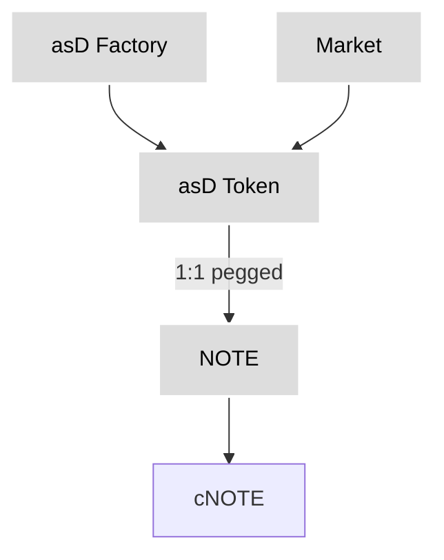
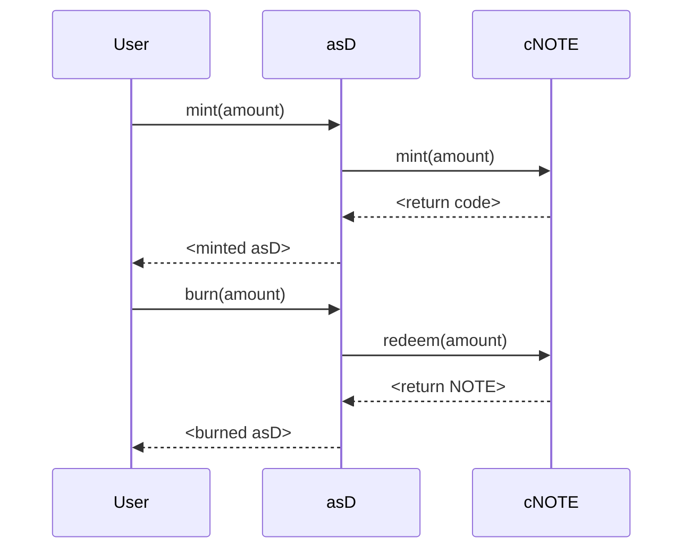
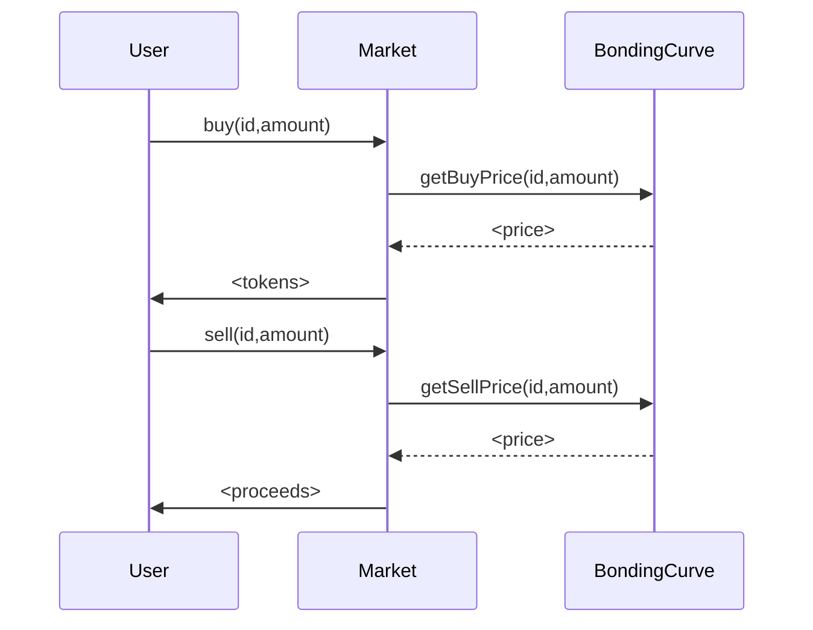

# Overview

Canto Application Specific Dollars and Bonding Curves for 1155s is an interesting system that allows creating ERC20 stablecoins pegged to NOTE and using them to back ERC1155 NFT shares. 

The overall architecture centers around:

- **asD** - ERC20 stablecoin contracts pegged 1:1 to NOTE
- **asDFactory** - Factory for deploying new asD contracts
- **Market** - ERC1155 contract for managing NFT shares backed by asD 

The main contracts are reasonably well modularized and make use of libraries like OpenZeppelin for security. The architecture overall seems sound.

However, through manual review several issues were identified related to access controls, input validation, withdrawal limits, and other validation.

# Detailed Analysis

Below is an analysis of the specific issues i discovered, their impact, root causes, risk levels, and mitigations. Critical issues that could break core invariants are highlighted first.

## Issues

### Unchecked Token Burning in asD

- **Contract**: asD.sol
- **Issue**: The `burn()` function does not validate the return code from `redeemUnderlying()`. This means if redeeming fails, asD tokens could be burned without redeeming the underlying NOTE, breaking 1:1 peg.
- **Impact**: Attacker burns asD tokens and receives NOTE, but contract fails to redeem underlying NOTE from cToken. Result is loss of peg and inability to redeem all asD tokens.
- **Likelihood**: Depends on failure rate of redeemUnderlying(), but would break core invariant.
- **Mitigation**: Store redeem return code and validate success before burning asD tokens:

```solidity
uint rc = cToken.redeemUnderlying(amount);
require(rc == 0, "Redeem failed"); 
_burn(msg.sender, amount);
```

- **Severity**: Critical

### Unchecked cToken Minting in asD 

- **Contract**: asD.sol
- **Issue**: `mint()` does not check return code from `cToken.mint()`. If minting fails, contract could have imbalance between cTokens and minted asD tokens.
- **Impact**: Attacker mints asD but underlying cToken mint fails. Result is loss of 1:1 peg backing.
- **Likelihood**: Depends on failure rate of cToken mint, but would break core invariant.
- **Mitigation**: Store cToken mint return code and revert on failure:

```solidity 
uint rc = cToken.mint(amount);
require(rc == 0, "Mint failed");
_mint(msg.sender, amount); 
```

- **Severity**: Critical

### Unchecked Bonding Curve Lookups in Market

- **Contract**: Market.sol 
- **Issue**: `buy()` and `sell()` functions pass `_id` to to `getBuyPrice()`/`getSellPrice()` without validating it is a valid share ID. This can cause transactions to revert if invalid ID is provided.
- **Impact**: Attackers can disrupt trades and deny service by intentionally passing invalid IDs that don't map to shares.
- **Likelihood**: Likely, invalid IDs can be guessed/brute-forced.
- **Mitigation**: Validate `_id` refers to existing share before passing to lookup functions:

```solidity
require(_id > 0 && _id <= totalShares, "Invalid id");
getBuyPrice(_id, _amount); 
```

- **Severity**: Critical

## High Severity Issues

### Unchecked Interest Withdrawal in asD

- **Contract**: asD.sol
- **Issue**: `withdrawCarry()` does not validate `_amount` is within accrued interest earnings. This allows owner to drain interest early.
- **Impact**: Owner withdrawals interest before it is actually earned, undermining sustainability.
- **Likelihood**: Depends on owner incentives, but no controls in place.
- **Mitigation**: Calculate accrued interest and limit amount:

```solidity
uint accruedInterest = calculateAccruedInterest();
require(_amount <= accruedInterest, "Exceeds accrued interest");
```

- **Severity**: High

### Unchecked Fee Withdrawal in Market 

- **Contract**: Market.sol
- **Issue**: `claimCreatorFee()` allows share creator to withdraw entire fee pool, not just accrued fees. Could drain funds.

- **Impact**: Creator can withdraw unearned fees, depriving other creators. Disrupts fee model.  

- **Likelihood**: Depends on creator incentives. No controls in place.

- **Mitigation**: Limit amount to accrued fees:

```solidity
uint creatorsAccruedFees = calculateAccruedFees(msg.sender); 
require(amount <= creatorsAccruedFees, "Exceeds accrued fees");
```

- **Severity**: High

### Unchecked NFT Minting in Market

- **Contract**: Market.sol
- **Issue**: `mintNFT()` does not verify caller's token balance before minting NFTs.

- **Impact**: Attacker mints NFTs without owning backing tokens, breaking core model.

- **Likelihood**: High if anyone can call mintNFT().

- **Mitigation**: Check balance before minting:

```solidity
require(balanceOf[msg.sender] >= amount, "Insufficient balance"); 
```

- **Severity**: High


### Front-Running of Pool Updates in Market

- **Contract**: Market.sol
- **Issue**: `claim{Platform/Creator/Holder}Fees()` update global fee pools, which can be front-run.

- **Impact**: Miners/bots can frontrun to drain fees before intended recipients.

- **Likelihood**: Highly likely and profitable for miners to frontrun.

- **Mitigation**: Use a pull-payment pattern instead of pushing funds:

```solidity
function withdrawAccruedPlatformFees() external {
  uint amount = accruedPlatformFees[msg.sender];
  accruedPlatformFees[msg.sender] = 0;
  msg.sender.transfer(amount); 
}
```

- **Severity**: High

## Medium Severity Issues 

### Missing Input Validation in Market

- **Contract**: Market.sol
- **Issue**: Functions like `buy()`, `sell()`, `mintNFT()` do not validate `_amount` parameter.

- **Impact**: Potential overflow/underflow if large or negative `_amount` is passed. Can corrupt state.

- **Likelihood**: Depends on expected valid amounts. Easier if huge amounts allowed.

- **Mitigation**: Validate `_amount`:

```solidity
require(_amount > 0 && _amount <= MAX_AMOUNT, "Invalid amount");
```

- **Severity**: Medium

### Imprecise Accounting in Market

- **Contract**: Market.sol
- **Issue**: Division operations can cause imprecision due to uint256 data type.

- **Impact**: Over time, accumulated precision errors could lead to meaningful loss of distributed fees.

- **Likelihood**: Almost certain with enough transactions.

- **Mitigation**: Use OpenZeppelin Math library for precision:

```solidity 
using Math for uint;
uint feePortion = _fee.mul(HOLDER_CUT).div(10_000);
```

- **Severity**: Medium

### Privileged Roles in Market

- **Contract**: Market.sol
- **Issue**: Owner has significant privileges including: whitelisting bonding curves, claiming platform fees, restricting share creation.

- **Impact**: Owner could potentially add malicious bonding curve, change core parameters against user expectations, etc.

- **Likelihood**: Depends on incentives of admin team, but privileged roles have potential for abuse.

- **Mitigation**: Establish a DAO or multi-sig owner. Create dedicated whitelister role. Rotate admin credentials.  

- **Severity**: Medium

## Low Severity Issues

### Gas Optimization

- **Contract**: Market.sol  
- **Issue**: `buy()` and `sell()` perform external calls before state changes. This opens up potential reentrancy flaws.

- **Impact**: Reentrancy would be mitigated by checks on share IDs and amounts. But optimization opportunity.  

- **Likelihood**: Low due to mitigating checks.

- **Mitigation**: Follow check-effects-interactions pattern:

```solidity
buy() {
  // Checks
  // Interactions 
  // State changes
} 
```

- **Severity**: Low

### Stylistic Comments

- Follow standard natspec comment formatting for consistency
- Use camelCase for local variables (not snake_case)
- Avoid redundancy in validation require statements 

### Documentation

- I find the natspec comments useful for providing context on parameters and return values. Consider expanding to cover other functions like withdrawCarry().

- Can improve clarity on platform fee percentages. Is the holder fee a subset of the creator fee?

- Provide more details on expected state changes and effects in comments.

### Testing

- Existing unit test coverage seems limited. Consider expanding tests for:
  - Validation logic
  - Access controls
  - Overflow/underflow conditions
  - Bonding curve properties

- Property-based testing could be beneficial for testing ranges of inputs.

- Fuzz testing could help identify edge cases not covered by happy path tests.

# Centralization Analysis 

## asD

The key centralized role is the owner of each asD token contract, who can:

- Withdraw accrued interest/yield
- Potentially update token parameters

This places trust in the owner to not withdraw excess yield or change parameters maliciously.

Recommended Mitigations:

- Interest withdrawals could require timelocks, DAO approval, or be limited to accrued amounts only.

- Core token parameters like name/symbol could be made immutable.

- Ownership could be transferred to a DAO rather than a single address.


## Market

The Market contract owner has significant privileges:

- Whitelisting bonding curves
- Restricting share creation 
- Claiming platform fees
- Updating core fee percentage parameters

This centralizes power and trust in the owner.

Recommended Mitigations:

- Use a DAO or multi-sig wallet for collective ownership.

- Create a dedicated whitelisting role with timelock rather than direct owner control.

- Make fee percentages immutable after initial setup.

- Adopt pull-based fee payments to limit central pooling of funds.


## Bonding Curves

All shares for a specific contract depend on the same bonding curve.

This centralizes control of the price model in the bonding curve owner.

Recommended Mitigations: 

- Allow shares to each select their own approved bonding curve.

- Make bonding curves immutable or community-controlled after launch.

- Support permissionless bonding curve proposals/listings.

Here are some suggested visual diagrams to provide additional clarity on the architecture and flows.

# Architecture Diagram



This shows the key components and 1:1 peg relationship between asD and NOTE.

**Mint/Burn Flow**



Illustrates minting/burning flow and interaction with cNOTE.

**Buy/Sell Flow** 



Shows buy/sell flow and pricing interaction with bonding curve.

## Recommendations

The key areas to mitigate centralization risk are:

- Decentralize privileged roles like whitelisting and fee control

- Avoid central pooling of community funds

- Empower communities to govern their own parameters

- Make core share parameters immutable 

- Adopt pull-based fee payments

This will distribute power across stakeholders rather than concentrating it with the development team or contract owners.


### Time spent:
8 hours