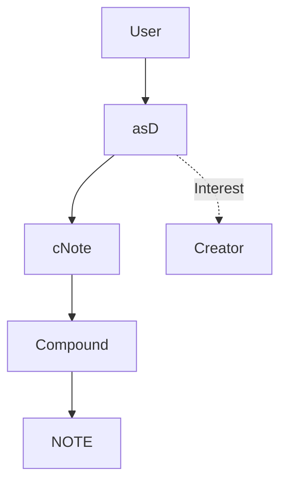
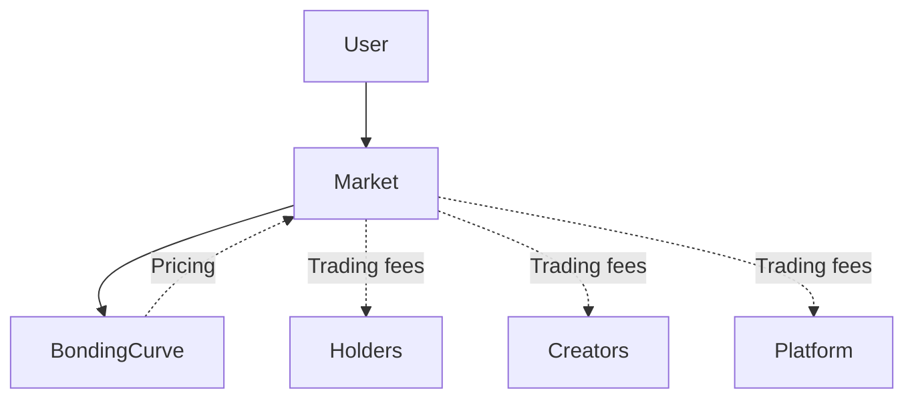
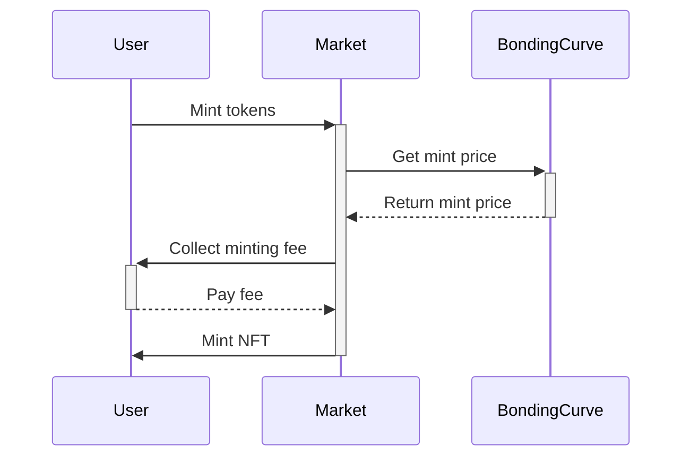
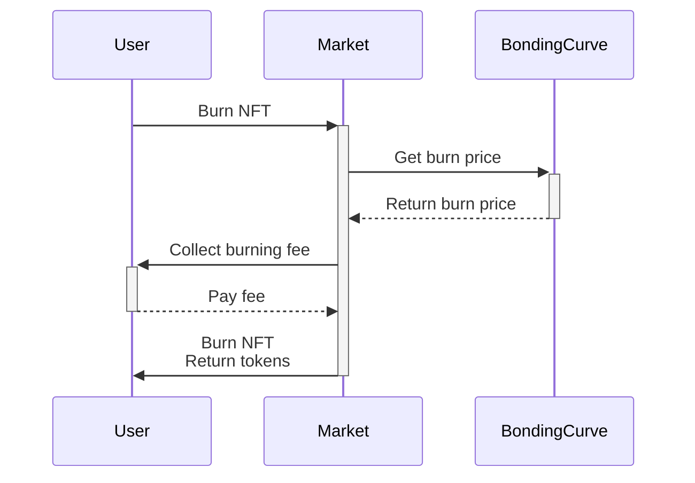

# Analysis of asD and 1155tech Contracts

## Overview

The asD and 1155tech contracts aim to provide a platform for creating stablecoin tokens pegged to NOTE (asD) and allowing tokenized bonding curves based on those stablecoins (1155tech).

Overall the contracts are well-architected to achieve the core goals of minting/burning asD tokens and providing a marketplace for shares. However, there are some centralization risks with the owner roles, and opportunities to further harden security.

## asD Contracts

The asD contracts utilize Compound's cTokens to provide interest yield on the NOTE reserves backing each asD token. Accrued interest can be withdrawn by the asD token creator.

### Positive Observations

- Simplistic design focused on core 1:1 peg invariants
- Interest model aligned with project goals
- Use of battle-tested Compound protocol and OpenZeppelin contracts

### Centralization Risks

- Each asD token creator has privileged access to withdraw interest accrued. This could lead to issues if creators are malicious.
- Lack of admin controls like pausing, blacklisting, and fee configuration increase reliance on creators making good initial configurations.

### Potential Issues

- Reentrancy vulnerability on [`mint()`](https://github.com/code-423n4/2023-11-canto/blob/b78bfdbf329ba9055ba24bd710c7e1c60251039a/asD/src/asD.sol#L47-L56) and [`burn()`](https://github.com/code-423n4/2023-11-canto/blob/b78bfdbf329ba9055ba24bd710c7e1c60251039a/asD/src/asD.sol#L60-L67) due to unprotected external calls. Could manipulate token supply.
- Reliance on cToken exchange rate for interest calculations. An incorrect rate could break 1:1 peg.
- Implicit trust of cToken and underlying NOTE contracts. Compromise of those contracts could break asD.

# Architecture and flows for the asD and 1155tech contracts:

**asD Architecture**

- Users mint/burn asD tokens
- asD deposits/redeems NOTE through cNote and Compound 
- Interest accrues to asD creator

**1155tech Architecture** 

- Users trade shares through the Market contract
- Market uses Bonding Curve for pricing shares
- Trading fees distributed to Holders, Creators, and Platform

**Minting/Burning Flow**

## 1155tech Contracts

The 1155tech contracts build a tokenized marketplace on top of asD stablecoins. Trading fees fund interest pools for creators, holders, and the platform.

### Positive Observations 

- Novel model for creating fractionalized, tradable shares in asD stablecoins.
- Dynamic pricing and yield using bonding curves.
- Share creation restrictable to limit abuse.

### Centralization Risks

- Owner has broad privleges over platform fees, bonding curve management, and share creation access.
- Bonding curves are trusted contracts - issues there could undermine share functioning.

On evaluating centralization risks and how trust could be distributed in the asD and 1155tech contracts:

**asD Contracts**

- Trust is concentrated in the token creator who can withdraw interest accrued. 

    - This could be distributed by moving interest handling to a DAO-governed contract.

    - Or by introducing a waiting period on withdrawals requiring multi-sig.

- Lack of admin controls centralizes power in initial configuration.

    - Pausing, fees, etc could be controlled by a DAO.

    - Or a timelock scheme could be used for privileged operations.

**1155tech Contracts** 

- Owner has broad power over platform fees, curves, and access control.

    - An admin DAO could manage privileged operations.

    - Checks and balances between multiple roles could distribute power.

- Bonding curves are trusted pricing oracles.

    - A decentralized oracle like Chainlink could provide resilience.

    - Curves could source data from a DAO governance contract.

- Share creators have centralized power.

    - Minting and burning could require approval from a DAO.

Overall, introducing DAO governance, decentralized oracles, timelocks, and additional roles could help distribute centralized control and trust in targeted ways.

The key is striking a balance - some central control is necessary for efficiency but power should be limited and distributed where possible between multiple parties.

### Potential Issues

- Lack of validation on NFT burning and token transfers - could break invariants.
- Reentrancy risk from unprotected external calls like transfers.
- Incorrect share data accounting could lead to unlockable funds or broken validation.

## Architecture Recommendations

- Use a trusted price oracle like Chainlink for share pricing to reduce reliance on bonding curve contracts.

- Implement pausing, admin fee configuration, and other admin controls in both contracts to limit reliance on good initial configuration.

- Clearly delineate owner admin privileges into focused roles like "guardian" or "governor" using a pattern like DAOstack.

- Conduct formal verification of core invariants and validation logic to prevent accounting bugs.

- Introduce purpose-specific access control roles using a standard like RBAC to restrict privileges.

## Codebase Quality

Overall the codebase is well-structured, modular, and adheres to best practices like:

- Descriptive comments and natspec documentation
- Separation of concerns between contracts
- Use of libraries like OpenZeppelin for security primitives
- Events and errors provide good observability 

Additional hardened practices like checks-effects-interactions, reentrancy guards, and validating return values from external calls would further improve quality.

## Conclusion

The asD and 1155tech contracts provide a unique approach to stabilized tradable shares. However, reliance on owner administrators and bonding curve oracles presents centralization risks. Targeted improvements to validation, access controls, and trusted dependency management can help mitigate these issues.

### Time spent:
10 hours