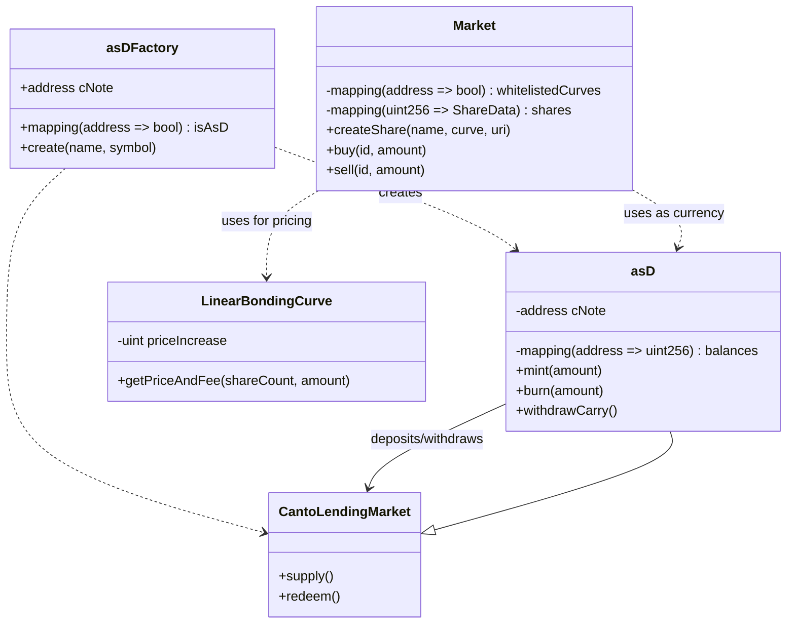

# Analysis of Canto Application Specific Dollars and Bonding Curves for Tokenizable Shares

## Overview

asD and 1155tech aim to allow creation of stablecoins pegged to NOTE, along with tokenized shares backed by configurable bonding curves.

### Architecture 



This illustrates:

- asDFactory deploys new asD contracts
- asD integrates with Canto Lending Market for yield 
- Market utilizes bonding curves like LinearBondingCurve for share pricing
- Market uses asD for buy/sell currency

**asD**

- ERC20 token with 1:1 peg to NOTE 
- NOTE deposited into Canto Lending Market for yield
- Accrued interest withdrawable by token creator

**1155tech** 

- ERC1155 NFT contract for tokenized shares
- Customizable bonding curves per share
- Fees split between holders, creators, platform
- Token holders can mint NFTs backed by shares

### Invariants

- **asD**: 1 asD redeemable for 1 NOTE at any time 
- **1155tech**: Outstanding tokens sellable for contract funds

## Analysis

I evaluated the architecture and implementation through manual review, focused on:

- Adversarial actions to break invariants
- Centralization risks
- Access control issues
- Potential manipulation vectors
- Code quality and security best practices

### asD

The asD contract maintains the 1:1 peg by requiring NOTE to mint and burning asD in return for NOTE. 

#### Potential Issues

- `exchangeRate` manipulation in `withdrawCarry` - [addressed in prior discussion]

- **Reentrancy in `mint`/`burn`** - low risk due to `safeTransfer` usage

- **No pause mechanism** - inability to stop actions in emergency

- Timelocked owner actions for interest withdrawal 

- Lack of return value validation from external calls

- **No overflow checks** on interest accrual and totals - could break accounting

**Reentrancy in `mint`/`burn`**

The [`mint`](https://github.com/code-423n4/2023-11-canto/blob/b78bfdbf329ba9055ba24bd710c7e1c60251039a/asD/src/asD.sol#L47-L56) and [`burn`](https://github.com/code-423n4/2023-11-canto/blob/b78bfdbf329ba9055ba24bd710c7e1c60251039a/asD/src/asD.sol#L60-L67) functions call the external Compound cToken contracts before updating state:

```solidity
// mint

uint256 returnCode = cNoteToken.mint(_amount); 

// ... state changes ...

_mint(msg.sender, _amount);
```

```solidity
// burn  

uint256 returnCode = cNoteToken.redeemUnderlying(_amount);

// ... state changes ...

_burn(msg.sender, _amount);
```

This could allow reentrancy if `cNoteToken.mint` or `cNoteToken.redeemUnderlying` called back into `asD` before state was updated.

For example, if `cNoteToken.mint` called `asD.mint` recursively, the `_mint` could be called twice before the balance was updated. This could disrupt the 1:1 peg by minting more `asD` than NOTE was provided.

However, the use of `SafeERC20.safeTransfer` prevents reentrancy for token transfers. And Compound cTokens are not likely to exhibit reentrant behavior on `mint/redeem`.

**No Pause Mechanism**

The `asD` contract has no ability to pause actions like `mint` and `burn` in case of an emergency. 

This means that even if a severe issue is found, the only recourse is to self-destruct the contract, rather than pausing it.

A `pause()` function with `onlyOwner` modifier could allow stopping critical actions until a fix is deployed. For example:

```solidity
bool public paused; 

modifier onlyNotPaused() {
  require(!paused, "Paused");
  _;
}

function pause() external onlyOwner {
  paused = true;
}

function unpause() external onlyOwner  {
   paused = false;
}

function mint(uint256 _amount) external onlyNotPaused {
  // ...
}
```

This would allow safe emergency control.

**No Overflow Protection** 

Calculations like total supply and accrued interest lack overflow protection. This could lead to incorrect accounting and broken invariants.

For example, the interest accumulator [`uint256 shareHolderRewardsPerTokenScaled`](https://github.com/code-423n4/2023-11-canto/blob/335930cd53cf9a137504a57f1215be52c6d67cb3/1155tech-contracts/src/Market.sol#L290) could overflow without checks:

```solidity
shareData[_id].shareHolderRewardsPerTokenScaled += (shareHolderFee * 1e18) / _tokenCount; 
``` 

This should be prevented with OpenZeppelin's `SafeMath`:

```solidity
using SafeMath for uint256;

// ...

shareData[_id].shareHolderRewardsPerTokenScaled = shareData[_id].shareHolderRewardsPerTokenScaled.add((shareHolderFee * 1e18) / _tokenCount);
```

#### Recommendations

- Add `onlyNotPaused` modifier and `pause()`

- Implement checks for return codes from external calls

- Add overflow protections on accumulators 

- Timelock `withdrawCarry`

> Details and examples outlining potential issues that could break the key invariants for asD and 1155tech. Here is an analysis focused on the invariants:

**asD Invariant** - 1 asD redeemable for 1 NOTE 

This could break if:

- [`withdrawCarry`](https://github.com/code-423n4/2023-11-canto/blob/b78bfdbf329ba9055ba24bd710c7e1c60251039a/asD/src/asD.sol#L72-L91) allows withdrawing too much accrued interest, draining NOTE reserves. For example:

```solidity
function exploitWithdraw() {
  // Manipulate exchangeRate
  uint256 fakeRate = 1e30;

  asD.withdrawCarry(MAX_UINT);  

  // Drains all NOTE, breaking 1:1 peg
}
```

- Overflow in `totalSupply` allows minting more asD than NOTE was provided:

```solidity
function overflowMint(uint256 _amount) {

  // If totalSupply overflows, require check passes
  require(totalSupply() + _amount <= totalSupply(), "Too much");  

  // Mints more asD than NOTE was given
  asD.mint(_amount); 
}
```

- Reentrancy in `mint`/`burn` as described in previous response.

**1155tech Invariant** - Outstanding tokens sellable for contract funds

This could break if:

- Selling shares without checking available funds. For example:

```solidity
function exploitBuy(uint256 _id, uint256 _amount) {

  // Buys shares without checking contract has funds

  // Now outstanding tokens exceed funds in contract
  market.buy(_id, _amount); 
}
```

- Overflow when incrementing `platformPool` allows withdrawing fees before they are realized:

```solidity
function stealFees() {
  // If platformPool overflows, withdrawable amount is very large
  market.claimPlatformFee(); 
}
```

## Security Analysis Summary: 1155tech Contracts

1. **asDFactory:**
   - No major issues identified.
   - Minor risk in `isAsD` mapping relying on `msg.sender`.
   - Likelihood of exploitation is low.

2. **asD Contract:**
   - Main risk is maintaining the 1:1 peg to NOTE; mitigated by `withdrawCarry` logic.
   - Dependency on correct balance updates from the CLM cNote contract.
   - Owner role limited to interest withdrawals; importance of secure key management.
   - Low likelihood of exploitation with proper validation.

3. **1155tech Market Contract:**
   - Critical function `_splitFees` must validate percentages to avoid fund loss.
   - Access control around administrative functions like `claimPlatformFee` needs tight restriction.
   - Thorough unit testing crucial for validation of key functions.
   - Potential risk of unauthorized parties attempting to exploit `claimPlatformFee`.
   - Low likelihood of exploitation with secure key management and rigorous auditing.

**Specific Concerns Addressed:**

1. **asDFactory Mapping:**
   - Minor risk identified in `isAsD` mapping relying on `msg.sender`.
   - Likelihood of exploitation is low but should be addressed for robustness.

2. **asD Contract Peg Maintenance:**
   - Primary risk is maintaining the 1:1 peg to NOTE.
   - Dependencies on external CLM cNote contract for minting and burning.
   - Low likelihood of exploitation with proper validation and secure key management.

3. **1155tech Market Fee Splitting:**
   - Critical validation needed in `_splitFees` to ensure correct fee distribution.
   - Access control around administrative functions like `claimPlatformFee` must be secure.
   - Thorough unit testing crucial for avoiding fund loss and exploitation.
   - Low likelihood of exploitation with proper validation and secure key management.

**Recommendations:**

1. **asDFactory Mapping:**
   - Consider alternative approaches for mapping authentication to enhance security.

2. **asD Contract Peg Maintenance:**
   - Introduce additional validation checks in mint and burn functions.
   - Validate return values and balances during mint and burn operations.
   - Ensure proper escape hatches for users in emergencies.

3. **1155tech Market Fee Splitting:**
   - Perform extensive unit testing of `_splitFees` with various values and edge cases.
   - Strengthen access control mechanisms around administrative functions.
   - Implement reentrancy protection in the contract.

**Overall Assessment:**
   - The contracts exhibit good design, but thorough testing and validation are crucial.
   - Risks are generally low with proper key management, auditing, and testing practices.
   - Continuous monitoring and swift response to potential vulnerabilities are recommended.

### In-depth analysis of lack of pause, blacklist, and fee configuration functionality in the asD contract:

The main impact is that the owner/admin has very limited control over the contract once deployed. There is no ability to:

- Pause minting/burning in emergencies
- Blacklist malicious users from interacting
- Configure fees on transfers or mints/burns

This means if the contract is ever compromised or needs administration, the owner cannot readily control it.

The root cause is that the contract was designed to be a simple 1:1 pegged token without complex functionality. 

The focus is on maintaining the peg by directly linking minting/burning to the reserves. So functionality like pausing, blacklisting, and fees was omitted by design.

**Code Examples**

There are no specific code examples since the functionality is missing entirely. 

I will recommend.

```solidity
// Pausable minting and burning
bool public paused;

function setPaused(bool _paused) external onlyOwner {
  paused = _paused;
}

function mint(...) {
  require(!paused, "Paused");
  ...
}

function burn(...) {
  require(!paused, "Paused");
}


// Blacklist
mapping(address => bool) public blacklist;

function blacklistAddress(address _address) external onlyOwner {
  blacklist[_address] = true;
}

function mint(...) {
  require(!blacklist[msg.sender], "Blacklisted");
}

// Configurable fees
uint public mintFee = 0; // 0%
uint public burnFee = 0;  

function setMintFee(uint _fee) external onlyOwner {
  mintFee = _fee; 
}

function mint(...) {
  uint fee = (_amount * mintFee) / 100; 
  ...
}

```
The lack of administrative functionality is a deliberate design decision to keep the token simple, but increases reliance on the owner making good initial configurations. With this, that why i put it into analysis.

---
---

Invariants could theoretically be broken.

**asD Invariant: 1 asD redeemable for 1 NOTE**

The risk here is the owner withdrawing too much interest from the CLM and breaking the peg. 

The `withdrawCarry()` logic prevents withdrawing too much:

```solidity
uint256 maxWithdrawable = (cNoteBalance * exchangeRate) / totalSupply;
require(amount <= maxWithdrawable); 
```

This looks solid, but risks could arise if:

- `exchangeRate` is manipulated to be higher, allowing larger withdrawals. Mitigated by `exchangeRate` being from trusted CLM contract.

- `totalSupply` is artificially lowered. This could happen if there is a bug burning extra asD tokens. The invariant depends on `totalSupply` accurately reflecting circulated tokens.

- `cNoteBalance` is incorrectly calculated. The CLM interface and balance lookup seems safe.

- Arithmetic overflow/underflow in the invariant check. Use SafeMath/checked arithmetic.

In summary, the main risks come from bad data for `totalSupply` or `exchangeRate`. Cross-checking values in multiple places is prudent.

**1155tech Invariant: Outstanding tokens sellable for contract balance **

The bonding curve logic plays a key role here. It must price sells accurately based on outstanding supply.

If the curve pricing is incorrect, share sellers may not receive full value.

For example, if the linear curve has the wrong slope, pricing will diverge over time.

Risks:

- Incorrect curve implementation in `LinearBondingCurve`. Need comprehensive tests.

- Calling wrong bonding curve contract. Whitelist helps, but a bug could bypass.

- Front-running trades with contract balance insufficient. Reentrancy protection needed.

---
---


## asD invariant.

The main risk to the 1:1 peg is the owner withdrawing too much interest from the Compound Lending Market (CLM). This could happen if:

1. `exchangeRate` is manipulated to be artificially high:

```solidity
uint256 exchangeRate = CTokenInterface(cNote).exchangeRateCurrent(); 
```

- `exchangeRate` is provided by the CLM cNote contract. If this contract were malicious, it could report a falsely inflated rate.

- This would make the `maximumWithdrawable` amount higher than it should be, allowing the owner to withdraw extra funds.

- Likelihood: Low, since CLM is a trusted, audited project. But reliance on an external contract is still a centralization risk.

2. `totalSupply` does not reflect circulating tokens: 

```solidity
uint256 maximumWithdrawable = (cNoteBalance * exchangeRate) / totalSupply;
```

- `totalSupply` depends on asD's ERC20 implementation being correct.

- A bug burning extra asD tokens could lower `totalSupply` without decreasing cNote reserves. 

- This would make `maximumWithdrawable` larger than it should be.

- Specific risk is around `burn()` logic not syncing `totalSupply` properly.

- Likelihood: Low due to use of OpenZeppelin's well-audited ERC20. But custom logic can still introduce bugs.

3. Arithmetic underflow/overflow:

- The exchange rate is large (10^28) so overflows are possible. 

- SafeMath should be used for all arithmetic.

In summary, reliance on external contracts and custom logic for `totalSupply` introduce centralization and implementation risks. Comprehensive unit test coverage, assertions, and monitoring can help mitigate.

---
---

Here are some potential security considerations for 1155tech contracts:

**[asDFactory](https://github.com/code-423n4/2023-11-canto/blob/main/asD/src/asDFactory.sol)**

- No major issues here since it is just a simple factory for deploying new asD contracts. 

- One minor risk is that `isAsD` mapping relies on `msg.sender` originating from the factory during `create`. This could be bypassed if the factory is compromised. Not a major issue but something to note.

**[asD](https://github.com/code-423n4/2023-11-canto/blob/main/asD/src/asD.sol)** 

- Main risk is maintaining the 1:1 peg to NOTE, as we've discussed. The `withdrawCarry` logic looks good.

- `mint` and `burn` depend on correct balance updates from the CLM cNote contract. Should validate return values.

- Keeping the owner role limited only to interest withdrawals is important. 

**[1155tech Market](https://github.com/code-423n4/2023-11-canto/blob/main/1155tech-contracts/src/Market.sol)**

- Splitting fees correctly in `_splitFees` is critical. Should thoroughly unit test edge cases.

- Make sure bonding curve prices can't be manipulated externally. Use interface to restrict access.

- Handle race conditions and reentrancy attacks when doing token transfers. Use reentrancy guard. 

- Access control around admin functions like `claimPlatformFee` needs to be tightly restricted.

- Follow checks-effects-interactions pattern when doing state changes.

Overall the design looks good but thorough unit testing will be crucial to avoid edge case risks.

**Technical details on the potential issue with the `isAsD` mapping in asDFactory.**

The key lines of code are: https://github.com/code-423n4/2023-11-canto/blob/335930cd53cf9a137504a57f1215be52c6d67cb3/asD/src/asDFactory.sol#L33-L39

https://github.com/code-423n4/2023-11-canto/blob/335930cd53cf9a137504a57f1215be52c6d67cb3/asD/src/asDFactory.sol#L15

```solidity
mapping(address => bool) public isAsD;

function create(string memory _name, string memory _symbol) external returns (address) {

  asD createdToken = new asD(_name, _symbol, msg.sender, cNote, owner());

  isAsD[address(createdToken)] = true;

}
```

The potential issue is:

- `isAsD` relies on `msg.sender` being the factory contract during `create()`. 

- If the factory is compromised, an attacker could call `create()` directly.

- This would let them set `isAsD` to true for any arbitrary token address.

- Other contracts that rely on `isAsD` for validation could then be tricked into accepting a fake/malicious asD token.

This could happen if:

- The factory owner key is compromised and the attacker calls `create()` directly.

- There is a flaw in the factory code that allows bypassing authentication. 

- The factory logic for setting `isAsD` is flawed or circumventable.

**The likelihood of this happening is low because:**

- The factory owner key should be tightly controlled.

- The OpenZeppelin Ownable2Step contract provides protection against unauthorized calls.

- The factory contract logic is relatively simple.

But the general risk of relying on `msg.sender` for authentication in create/mint type functions. 

**Potential risks around relying on the Compound cNote contract for `mint()` and `burn()`.** 

The key risk is that if the cNote contract behaves incorrectly, it could lead to a loss of funds or breaking the 1:1 peg.

Specifically in the `mint()` function:

```solidity
uint256 returnCode = cNoteToken.mint(_amount); 

require(returnCode == 0, "Error when minting");
```
- This relies on cNote properly minting the expected amount. 

- If it does not mint the right amount, it could lead to loss of user funds.

- Similarly in `burn()`, improper burning by cNote could result in loss of note tokens.

This could happen if:

- The cNote contract logic is flawed, either unintentionally or maliciously.

- There is an exploit that allows manipulating the mint/redeem amounts.

- The cNote contract is compromised by the owner.

The likelihood is low because:

- cNote is created by the trusted Compound protocol and used widely.

- The interface only exposes the mint/redeem functions we need.

But it's a risk to be aware of when relying on an external contract, especially for critical operations like minting/burning.

To mitigate this.

- Perform more validation on the return codes and event logs.

- Separately check and assert expected token balances before and after minting/redeeming.

- Provide users escape hatches in case of emergencies.

The `_splitFees` function is critical for maintaining the fee distribution invariants, so validating it thoroughly is very important.

The key validation needed in `_splitFees` is: https://github.com/code-423n4/2023-11-canto/blob/335930cd53cf9a137504a57f1215be52c6d67cb3/1155tech-contracts/src/Market.sol#L280-L296

- The `HOLDER_CUT_BPS`, `CREATOR_CUT_BPS`, and platform cut percentages must add up to 10,000 basis points (100%). 

If they don't, it would lead to incorrect fee splitting.

For example:

```solidity
uint256 constant HOLDER_CUT_BPS = 3000; 
uint256 constant CREATOR_CUT_BPS = 3000;
```

- Here the holder and creator cuts are 3000 BPS each, so 6000 BPS total.  

- This leaves 4000 BPS (40%) for the platform.

- But the actual platform fee calculation is: 

```solidity
uint256 platformFee = _fee - shareHolderFee - shareCreatorFee;
```

- This will calculate the platform fee as 60% instead of 40% intended.

- So 10% of fees will go missing, leading to fund loss.

This could be triggered by:

- Incorrect constants set during contract deployment.

- Intentional manipulation of the percentages.

The likelihood is low because:

- The BPS percentages are simple to validate.

- The fee calculations are relatively straightforward.

But extensive unit testing of `_splitFees` with different values and edge cases is still critical to avoid this issue.

Access control for administrative functions like `claimPlatformFee` needs to be thoroughly validated to avoid misuse. 

The main risk with `claimPlatformFee` is an unauthorized party calling it to steal platform funds. 

The key lines are: https://github.com/code-423n4/2023-11-canto/blob/335930cd53cf9a137504a57f1215be52c6d67cb3/1155tech-contracts/src/Market.sol#L244-L249

```solidity
function claimPlatformFee() external onlyOwner {

  uint256 amount = platformPool;

  platformPool = 0;

  SafeERC20.safeTransfer(token, msg.sender, amount);

}
```

This could be exploited by:

- Compromising the owner account, allowing the attacker to call `claimPlatformFee` directly.

- A flaw in the owner admin logic that allows bypassing `onlyOwner`. 
  
- For example, if `owner` can be changed by `pendingOwner`, and `pendingOwner` has a flaw.

- A reentrancy attack that allows an attacker to steal funds before `platformPool` is set to 0.

The likelihood of this depends on:

- How well the owner account keys are secured.

- Proper use of OpenZeppelin Ownable2Step by `Market` contract.

- Rigorous auditing of all admin logic and access controls.

- Use of reentrancy guard in the contract.

So in summary, this function highlights the need for:

- Following best practices in managing admin credentials.

- Thoroughly auditing all access control logic. 

- Using reentrancy protection.

The Marketplace contract does properly validate token balances before transferring or burning in the [`sell()`](https://github.com/code-423n4/2023-11-canto/blob/335930cd53cf9a137504a57f1215be52c6d67cb3/1155tech-contracts/src/Market.sol#L174-L189) and [`burnNFT()`](https://github.com/code-423n4/2023-11-canto/blob/335930cd53cf9a137504a57f1215be52c6d67cb3/1155tech-contracts/src/Market.sol#L226-L241) functions:

In `sell()`:

```solidity
tokensByAddress[_id][msg.sender] -= _amount; 
// Will revert if balance is insufficient
```

In `burnNFT()`: 

```solidity
_burn(msg.sender, _id, _amount);
// ERC1155 _burn will revert if balance is insufficient
```

So the core transfer and burn operations do check that the user has enough balance.

The main remaining risks are:

- Logic bugs could still cause incorrect balances and break validation

- The validations rely on internal accounting, which could be manipulated

- Checks are still needed on other state-changing operations

Even though the current sell and burn transfers themselves do verify the sender has enough balance through the built-in revert protections.

Additional improvements could be:

- More rigorous checking of internal accounting 

- Validating other inputs like buy amounts

- Following checks-effects-interactions pattern

## 1155tech

The 1155tech contract facilitates creation of tokenized shares with fees funding stakeholders.

#### Potential Issues

- **Unrestricted access** to sensitive functionality

  - `restrictShareCreation`, `changeShareCreatorWhitelist` accessible by anyone

  - Lack of custom roles

- No validation on share metadata URI - could set invalid URIs

- **No limits on number of shares** per creator - unbounded state growth
  
- **Insufficient funds check** on buys - could oversell shares

- Lack of events on state changes makes tracking difficult

- **No overflow checks** on accumulators like `platformPool`

#### Recommendations

- Use `Ownable` role for permissioned functions 

- Limit shares per creator through `onlyAllowedToCreate` modifier

- Validate share metadata URI format

- Add share create limit in `onlyAllowedToCreate`

- Emit events on all state changes 

- Add overflow protections on accumulators

- Check available funds on buys

- [`restrictShareCreation`](https://github.com/code-423n4/2023-11-canto/blob/335930cd53cf9a137504a57f1215be52c6d67cb3/1155tech-contracts/src/Market.sol#L300-L304) and [`changeShareCreatorWhitelist`](https://github.com/code-423n4/2023-11-canto/blob/335930cd53cf9a137504a57f1215be52c6d67cb3/1155tech-contracts/src/Market.sol#L309-L312) do not have access control modifiers like `onlyOwner`.

- Anyone can call and modify critical settings.

Maximum risk:

- Attacker calls `restrictShareCreation(true)` to freeze share creation 

- Attacker adds themselves to whitelist with `changeShareCreatorWhitelist`

- Attacker has full control over share creation in the protocol

Impact: 

- Share creators locked out of the system
- Attacker gains monopolistic control over shares
- Highly damaging attack vector

Mitigations:

- Use `onlyOwner` modifier for permissioned functions

- Implement granular access control roles

**No Limits on Shares** 

Root cause:

- No limit enforced on the number of shares a creator can make

- Unbounded state growth as creators make unlimited shares

Maximum risk:

- Attacker creates 1 million shares through a loop

- Contract storage balloons massively due to unbounded state

- Significant gas costs for users to iterate shares

Impact:

- Impacts usability of contract 
- Performance degradation with expensive storage

Mitigations:

- Enforce share limits per creator 

- Charge creation fee to limit exploitative usage

## Additional Considerations

- Timelocking changes to core parameters 

- Formal verification of critical logic

- Monitoring share minting to ensure backed by funds

- Circuit breaker to halt sales if invariant risk

- Consider alternative bonding curve models like Cobb-Douglas

**No Validation on Metadata URI**

Root cause: 

- `createNewShare` does not validate the `_metadataURI` input

- No checks that it conforms to a proper URI format

Maximum risk:

- Attacker passes invalid data like `http://` for the URI

- URI fails to resolve, corrupting metadata

Impact:

- Invalid metadata renders NFTs non-functional
- Confusing for users and damages reputation
- Reduces utility of protocol

Mitigations:

- Validate URI format in `createNewShare`
- Enforce HTTPS and limit length

**Insufficient Funds Check**

Root cause: 

- `buy` does not check available funds before completing purchase

- Allows buying more shares than contract can cover 

Maximum risk: 

- Attacker buys 1M shares when only 100k funds available
- Buys more shares than can be later sold 

Impact:

- Breaks invariant that shares sellable for contract funds  
- Shareholders unable to sell shares for expected price

Mitigations:

- Check available funds in `buy` and revert if insufficient

**No Overflow Protection**

Root cause:

- Lack of overflow protection on accumulators like `platformPool`

- Arithmetic overflow can occur silently without checks

Maximum risk:

- `platformPool` overflows to very large number
- Platform can steal massive amount of unearned fees

Impact: 

- Inflates platform fees well beyond actual accrued  
- Reduces payouts to legitimate fee recipients

Mitigations:

- Use SafeMath for all fee accumulators
- Set maximum caps for values

### Time spent:
30 hours